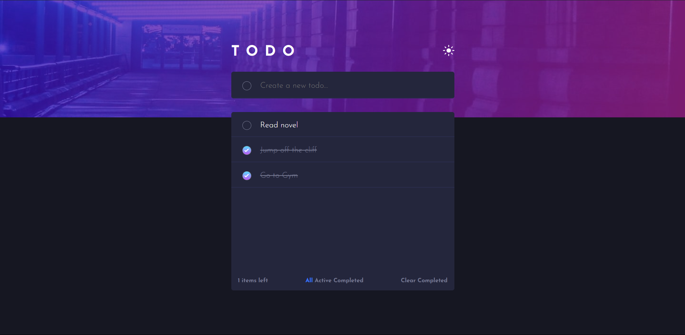
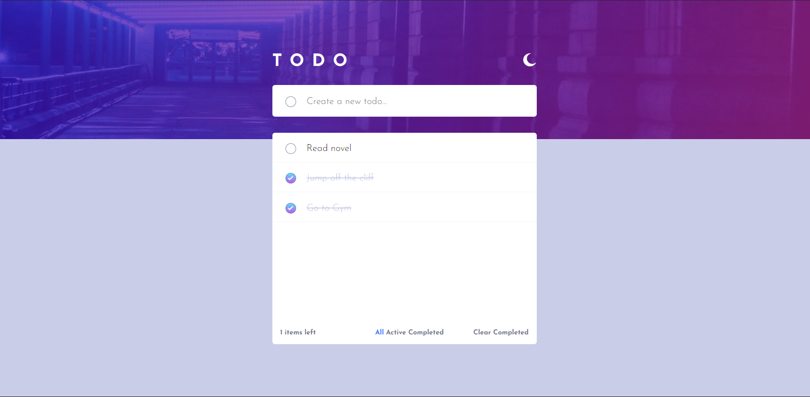

# Todo App

A Todo application created using Vanilla Javascript. The application was a [Todo app challenge on Frontend Mentor](https://www.frontendmentor.io/challenges/todo-app-Su1_KokOW). 

## Table of contents

- Overview
- Screenshot
- Links
- My process
  - Built with
  - What I learned
  - Continued development

## Overview
The Todo App is a simple application created using Vanilla Javascript. In this app, user can manage their day-to-day task by creating a todo list and following it. User can add new tasks, check/crossout the completed task, and delete the unnecessary ones as well. The application also shows a counter, which keeps track of the number of active task, and user can switch between the active and completed tasks as well. All the data is storage locally, so the user can come back to the application without losing their progress. Users can also switch between Dark and Light theme. 

## Screenshot
Here are some screenshots to the Todo App.

## Links
Here is the live URL to Todo App: [Todo App](https://todo-qph3rfgsl-d3monvikings-projects.vercel.app/)

## My process
### Build With 
- Semantic HTML5 markup
- Flexbox
- CSS Grid
- Vanilla Javascript
- localStorage API

### What I Learned
While building the Todo App, I used various Javascript concepts like DOM, Events, Destructuring, and localStorage API. Several CSS concepts like Grid, Flexbox, and Responsiveness were used in building the application.

### Continued Development
After using localStorage in the project, I would like to explore more Web Storage APIs in my future project. 
